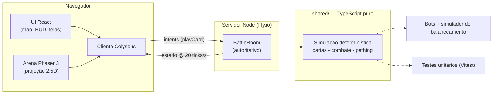

# 👑 Claude Royale

**Batalhas 1v1 estilo Clash Royale, multiplayer em tempo real, direto no navegador** — tela cheia, orientação paisagem, feito para jogar com o celular deitado.

🌐 **Jogue: [clauderoyale.net](https://clauderoyale.net)** · 🇺🇸 [Read in English](README.md)

[](https://github.com/adrianoreinert/claude-royale/actions/workflows/ci.yml)
[](LICENSE)
[](https://github.com/adrianoreinert/claude-royale/releases)
[](CONTRIBUTING.md)
[](https://stats.uptimerobot.com/wHLcslngdD)
[](https://discord.gg/CCnKH4XBmy)
[](https://clauderoyale.itch.io/claude-royale)


<p align="center">
  
</p>

| | |
|---|---|
|  |  |
| *Home — matchmaking, ranking, Passe Real* | *Batalha 1v1 — servidor autoritativo a 20 ticks/s* |
|  |  |
| *49 cartas colecionáveis com histórico de balanceamento* | *Toda partida é gravada — reassista na hora* |

## O que é

Um projeto de estudo que virou um jogo completo: batalhas 1v1 em tempo real com tropas, feitiços, torres e elixir, rodando em um **servidor Node autoritativo** com **simulação determinística compartilhada** — o mesmo código TypeScript que roda a partida também alimenta os bots, as simulações de balanceamento headless e os testes unitários.

**Destaques**

- ⚔️ **1v1 em tempo real** com matchmaking, salas privadas (código de 4 letras), espectador ao vivo e reconexão automática (30s de tolerância)
- 🃏 **49 cartas colecionáveis** por composição de componentes — escudo, roubo de vida, aura de cura, zona de veneno, carga, voadores, construções geradoras, coletor de recurso, espelho e mais
- 🏆 **Campeões** com habilidade ativa e **evoluções** que disparam a cada N usos
- 🤖 **Bots no servidor** em 3 dificuldades, modo bot vs bot e **simulador de balanceamento** headless que joga centenas de partidas para calibrar as cartas
- 📽️ **Replays** gravados no cliente (play/pause, 2x)
- 📊 **Patches de balanceamento versionados** como dados, com classificação semântica (buff/nerf) e histórico legível pelo jogador na Coleção
- 📱 **PWA** — instalável, cache offline de assets, fullscreen paisagem com trava de orientação

## Como jogar

**Online:** [clauderoyale.net](https://clauderoyale.net)

**Local:**

```bash
pnpm install
pwsh tools/fetch-assets.ps1   # baixa os sprites Tiny Swords (não versionados — a licença proíbe redistribuição)
pnpm dev
```

- Cliente: http://localhost:5173 (use a URL de **Network** do Vite para jogar pelo celular na mesma rede)
- Servidor: ws://localhost:2567

Abra o jogo em **duas abas** (ou dois aparelhos) e clique em ⚔️ Batalhar nas duas — a partida começa quando os dois entram. Ou jogue sozinho em **Treinar vs Bot**.

```bash
pnpm test   # testes unitários da simulação (Vitest)
```

## Hospede o seu

O cliente é estático e o servidor é um processo Node — qualquer combinação "static host + VPS" funciona.

**Um comando (Docker Compose):**

```bash
docker compose up --build
# cliente em http://localhost:8080, servidor em ws://localhost:2567
```

**Deploy manual:**

```bash
# Servidor (Render / Railway / Fly.io / VPS) — coloque um proxy TLS na frente (o navegador exige wss:// em páginas https://)
docker build -f server/Dockerfile -t claude-royale-server .
docker run -p 2567:2567 claude-royale-server

# Cliente (Vercel / Netlify / Cloudflare Pages)
VITE_SERVER_URL=wss://seu-servidor.exemplo.com pnpm --filter @claude-royale/client build   # gera client/dist
```

## Modos e telas

- **Batalha 1v1** — matchmaking em tempo real, emotes, desistência, reconexão automática
- **Jogar com amigo** — sala privada por código de 4 letras
- **Assistir** — espectador ao vivo de qualquer partida pelo código da sala
- **Treinar vs Bot** — 3 dificuldades (fácil reage tarde; médio defende e usa feitiços; difícil faz counters por tipo, finaliza torre com feitiço e apoia pushes)
- **Assistir Bots** — bot vs bot ao vivo, ótimo para estudar interações de cartas
- **Elixir infinito** — modo festa para testar mecânicas
- **Skins de arena** — Campo, Deserto, Neve e Noite (persistem no aparelho)
- **Ranking** — troféus no servidor, top 5 na home
- **Coleção / Deck / Perfil** — modal de estatísticas (vida, dano, DPS, alcance, velocidade, alvos), deck de 8 cartas com custo médio de elixir, perfil editável com histórico de partidas

## Arquitetura

```
claude_royale/
├── client/   # Vite + React + Phaser 3
│   └── src/
│       ├── game/   # cena Phaser, projeção 2.5D, entidades, efeitos
│       ├── ui/     # React: mão de cartas, elixir, telas, overlays
│       └── net/    # cliente Colyseus
├── server/   # Node + Colyseus (BattleRoom espelha a simulação no schema)
├── shared/   # cartas, constantes, projeção e TODA a simulação
└── tools/    # scripts e2e (Playwright), download de assets
```



**Princípios**

- **Servidor autoritativo** — toda a lógica (elixir, spawn, pathing, combate, vitória) roda no servidor a 20 ticks/s. O cliente só envia *intents* (`playCard`) e renderiza o estado interpolado.
- **2.5D em paisagem** — grid lógico 32×18 projetado em trapézio ([shared/src/projection.ts](shared/src/projection.ts)): o topo da tela fica "mais longe", sprites escalam pela profundidade e o depth-sort segue o Y da tela.
- **Visão espelhada** — cada jogador vê o próprio lado à esquerda; o cliente espelha renderização e input ([client/src/game/view.ts](client/src/game/view.ts)).
- **Tela cheia + paisagem** — Fullscreen API + `screen.orientation.lock('landscape')` ao entrar na batalha, overlay "gire o aparelho" em retrato via CSS.
- **Segurança** — o servidor valida todos os payloads e aplica rate-limit em cartas (200ms) e emotes (2s).

## Motor de cartas (composição de componentes)

As cartas são definidas por **composição** em [shared/src/engine/model.ts](shared/src/engine/model.ts): identidade (nome, tipo, subtipo, raridade, custo, tags) + componentes opcionais (`health`, `movement`, `targeting`, `attack`, `charge`, `spawner`, `deathEffect`, `deployEffect`, `resource`, `lifetime`, `aura`, `spell`) — qualquer combinação é válida e novas mecânicas entram como novos componentes, sem tocar no núcleo.

- **Atributos derivados** ([engine/derived.ts](shared/src/engine/derived.ts)): DPS, vida efetiva, eficiência por elixir — sempre calculados, nunca armazenados
- **Validação no carregamento** ([engine/model.ts](shared/src/engine/model.ts)): carta inválida derruba o build, não a partida
- **Balanceamento versionado** ([shared/src/balanceHistory.ts](shared/src/balanceHistory.ts)): valores mudam por patches de DADOS com classificação semântica automática (intervalo menor = buff, custo maior = nerf…), justificativa e histórico legível pelo jogador
- **Ferramenta admin**: `pnpm --filter @claude-royale/server edit-card <carta> <atributo> <valor> [justificativa]`

## Regras de jogo

- Elixir: regenera 1 a cada 2,8s (2x na morte súbita), máximo 10
- Partida: 3 min + 1 min de morte súbita; vence quem derrubar o rei (3 coroas) ou tiver mais coroas
- Tropas atravessam o rio apenas pelas pontes, priorizam inimigos próximos sobre torres (Gigante só ataca construções) e **não se sobrepõem** (separação por colisão)
- **Torre do rei começa adormecida** (💤): só ataca depois de tomar dano ou perder uma princesa — flanquear tem estratégia

## Balanceamento por simulação

```bash
pnpm --filter @claude-royale/server balance 600
```

Roda N partidas bot vs bot com decks aleatórios e imprime a winrate por carta. Os números atuais foram calibrados assim (spread reduzido de ~21 para ~16 pontos). Cartas que dependem de escolta (Gigante) ficam subestimadas pelo bot médio — o difícil apoia pushes.

## Assets e créditos

Tropas, torres, decoração e explosões usam o pack gratuito **[Tiny Swords](https://pixelfrog-assets.itch.io/tiny-swords)** do Pixel Frog (uso pessoal/comercial permitido, redistribuição proibida — ver [CREDITS.md](client/public/assets/tiny-swords/CREDITS.md)). Música de batalha: "Medieval: Battle" por RandomMind (CC0, [OpenGameArt](https://opengameart.org/content/medieval-battle)). SFX: packs do [Kenney](https://kenney.nl) (CC0). O terreno da arena é procedural, desenhado tile a tile com a projeção em perspectiva.

A UI dos menus usa opcionalmente o pack pago **Synty Interface — Fantasy Menus** (não versionado; ver [CREDITS.md](client/public/assets/ui/CREDITS.md)). Sem ele, a UI usa fallbacks de CSS — tudo continua funcionando.

> ⚠️ Não use assets do fankit da Supercell — os termos proíbem uso em outros jogos.

## Contribuindo

PRs são bem-vindos! Leia o [CONTRIBUTING.md](CONTRIBUTING.md) e confira as [issues](https://github.com/adrianoreinert/claude-royale/issues) — procure por `good first issue`. Siga o [Código de Conduta](CODE_OF_CONDUCT.md); vulnerabilidades vão por [SECURITY.md](SECURITY.md).

Dúvidas ou precisa de ajuda? Veja o [SUPPORT.md](SUPPORT.md) ou escreva para **hello@clauderoyale.net**.

## Roadmap

- [ ] Níveis de carta / progressão de coleção
- [ ] Torneios (chaves com salas privadas encadeadas)
- [ ] Mais campeões e evoluções
- [ ] Internacionalização (i18n) — o jogo hoje é em português

## Licença

[MIT](LICENSE) para o código-fonte. Assets de terceiros mantêm as licenças próprias — veja a nota na [LICENSE](LICENSE) e em [Assets e créditos](#assets-e-créditos).
